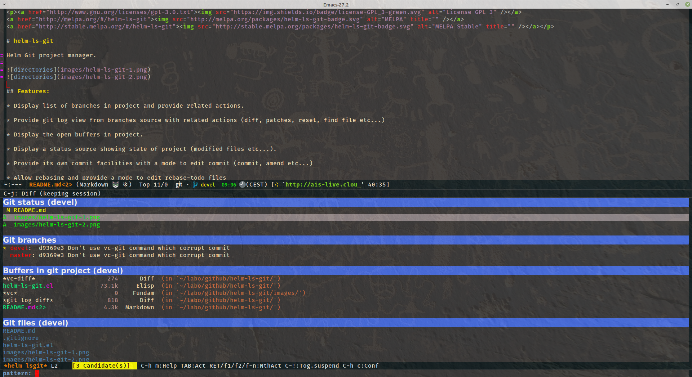
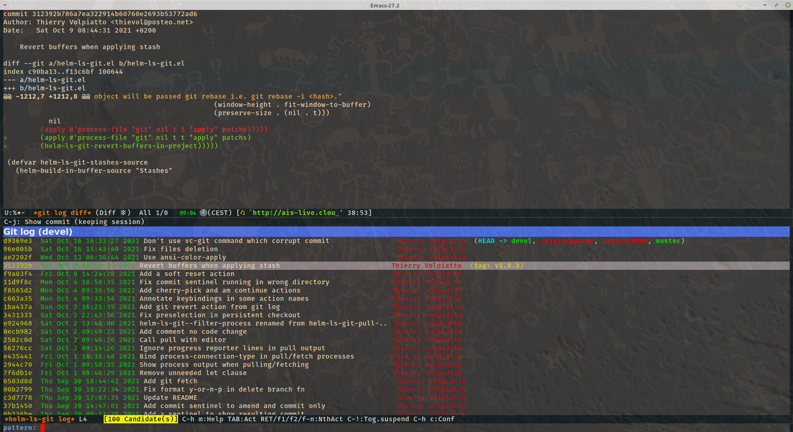

<p><a href="http://www.gnu.org/licenses/gpl-3.0.txt"></a>
<a href="http://melpa.org/#/helm-ls-git"></a>
<a href="http://stable.melpa.org/#/helm-ls-git"></a></p>

<iframe src="https://github.com/sponsors/emacs-helm/button" title="Sponsor emacs-helm" height="32" width="114" style="border: 0; border-radius: 6px;"></iframe>
# helm-ls-git

Helm Git project manager.




## Features:

* Display list of branches in project and provide related actions.

* Provide git log view from branches source with related actions (diff, patches, reset, find file etc...)

* Display the open buffers in project.

* Display a status source showing state of project (modified files etc...).

* Provide its own commit facilities with a mode to edit commit (commit, amend etc...)

* Allow rebasing and provide a mode to edit rebase-todo files

* Display stashes list and provide related actions.

* Display a list of all files in project under git control.

* Allow looking quickly at diff on modified files.

* Allow switching to git status with your preferred frontend (vc-dir, magit,etc...)

* Full integration of `git-grep`, allow also usage of `helm-grep` (you can use `ack-grep` instead of `grep`).

* Integrate usage of `gid` from [id-utils](https://www.gnu.org/software/idutils/).

* Full integration with `helm-find-files`, allow you to browse project unrelated to current-buffer.

* In addition, all actions of type files and buffers are provided.

## Installation

* We assume that you have `git` installed and that OSX users have
  solved [any `$PATH` issues](https://gist.github.com/jhrr/8852178)
  that prevent them being able to call `git` from emacs.

* Ensure you are running at least >= Emacs-24.3.

* Install `helm` according to the [instructions on its repo
  page](https://github.com/emacs-helm/helm#getting-started)

* If you are using the MELPA package manager then `M-x list-packages`
  and install `helm-ls-git`.

* Or, if you are using `el-get` then invoke `M-x el-get-install` and at
  the `Install package:` prompt type `helm-ls-git` and hit enter.

* Otherwise, clone this repo and put `helm-ls-git.el` somewhere on the
  emacs `load-path`.

* Finally, add to your `.emacs.el`:

Assuming you are already using helm and it is installed properly (See [Install helm](http://emacs-helm.github.io/helm/))

```elisp
(require 'helm-ls-git)
```
Use M-x `helm-browse-project` or bind it to a key, for example:

```elisp
(global-set-key (kbd "C-x C-d") 'helm-browse-project)
```

If you are using `helm-find-files` you will be able to browse any git repo unrelated
to the `current-buffer`:
M-x `helm-find-files`
navigate to some git repo and hit `C-x C-d`

You can also navigate in your git projects with M-x `helm-projects-history` or bind it to a key:

```elisp
(global-set-key (kbd "C-x r p") 'helm-projects-history)
```

If you want to use the helm-ls-git sources somewhere else, you can build them individually with functions
`helm-ls-git-build-git-status-source`, 
`helm-ls-git-build-buffers-source` and `helm-ls-git-build-ls-git-source`.

As these sources are built with their own classes, they can be configured with defmethod `helm-setup-user-source`,
see [FAQ](https://github.com/emacs-helm/helm/wiki/FAQ#why-is-a-customizable-helm-source-nil).

## Usage

Use `helm-projects-history` or `helm-browse-project` as a starting point.

* By calling `helm-browse-project` in any buffer that is a part of a
  git repo (or if you have navigated to a git repo from
  `helm-find-files`), you will be presented with a corresponding helm
  buffer containing a list of all the files currently in that same
  repository. In the usual `helm` style you can just type at the
  prompt in the minibuffer and see the results narrow according to the
  input of your search pattern.

* When the helm-buffer is active and displaying results, the user can
  invoke `C-]` to toggle between showing filenames or full pathnames
  for the data that helm is listing.

NOTE: You can also use directly `helm-ls-git-ls`, but note that in
this case your project will NOT be recorded in project history and BTW
not available through M-x `helm-projects-history`.

Another way to record your projects is using bookmarks from `helm-find-files` (`C-x r m`).

Have fun!
